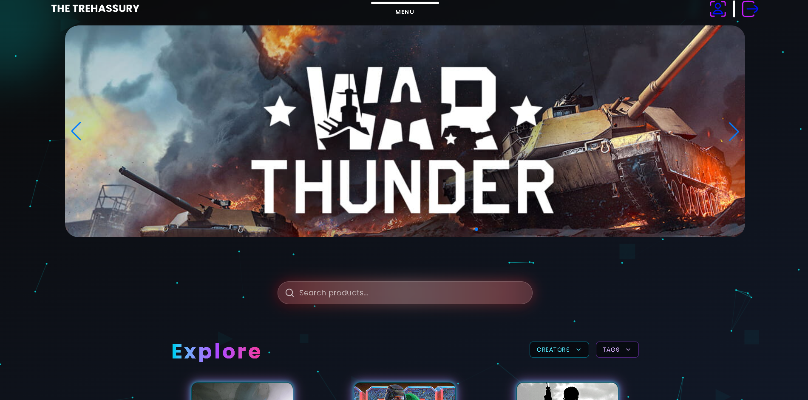
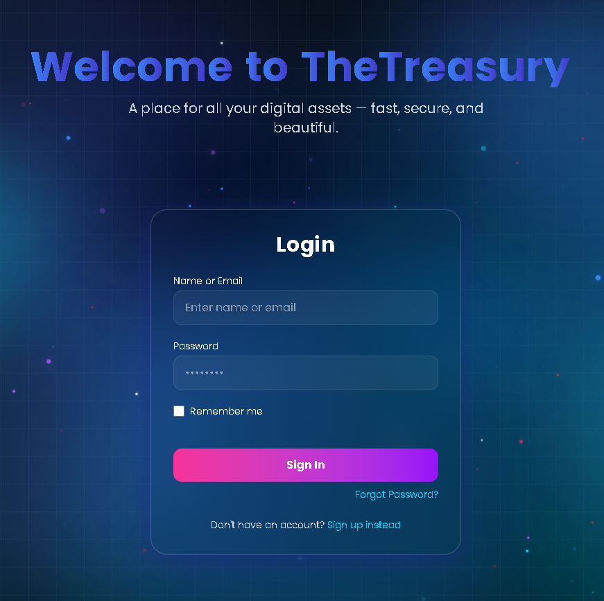
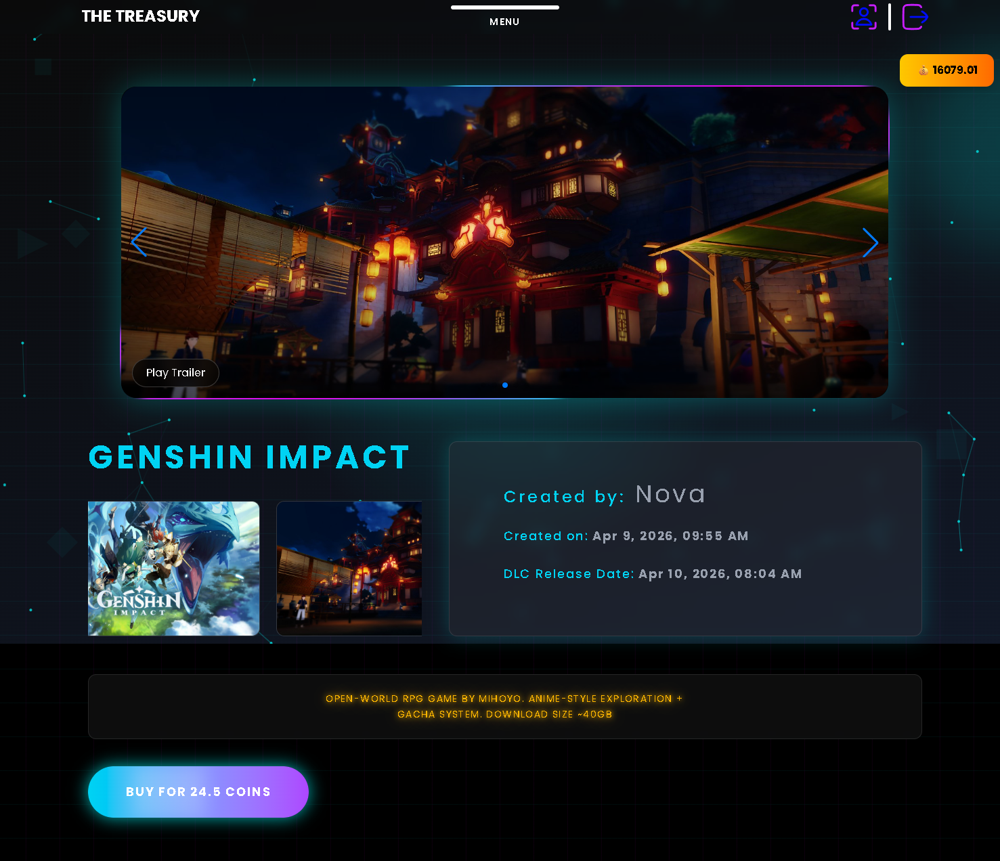
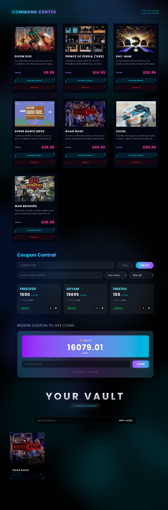
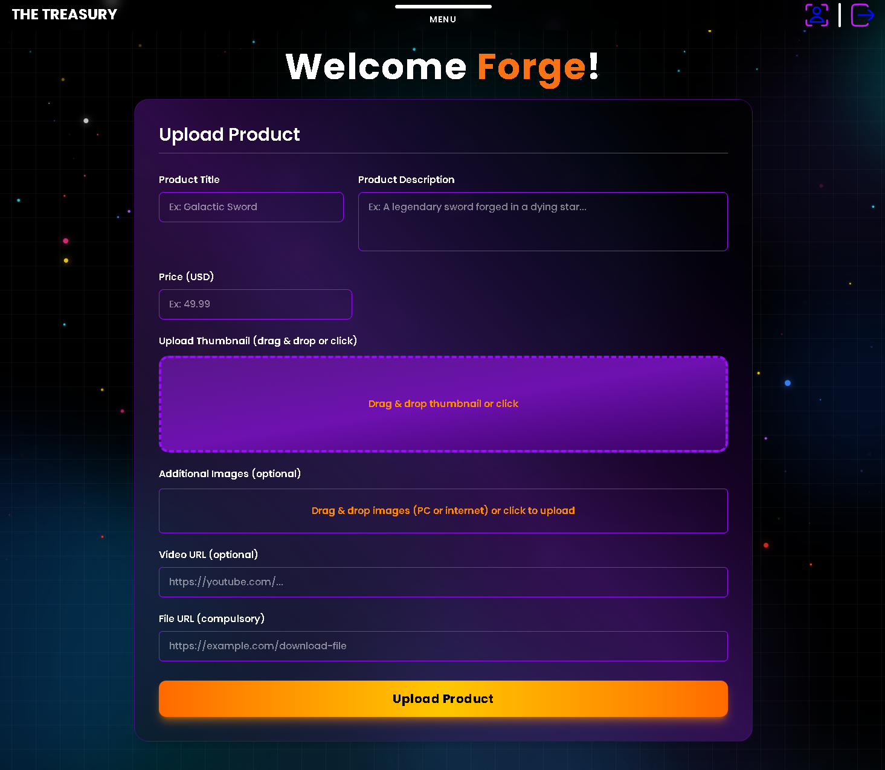
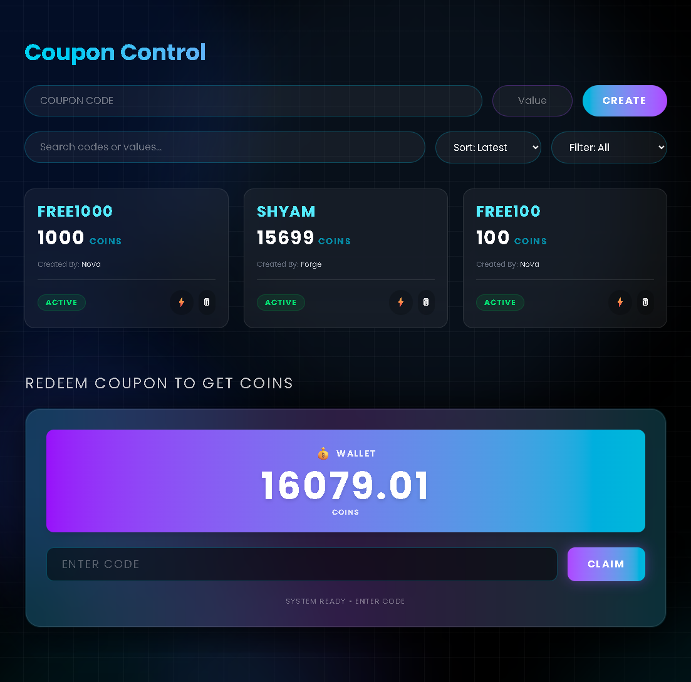
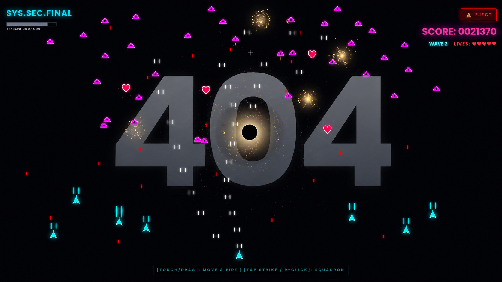
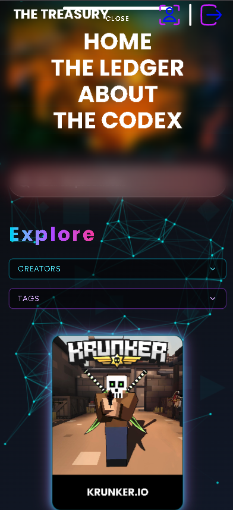
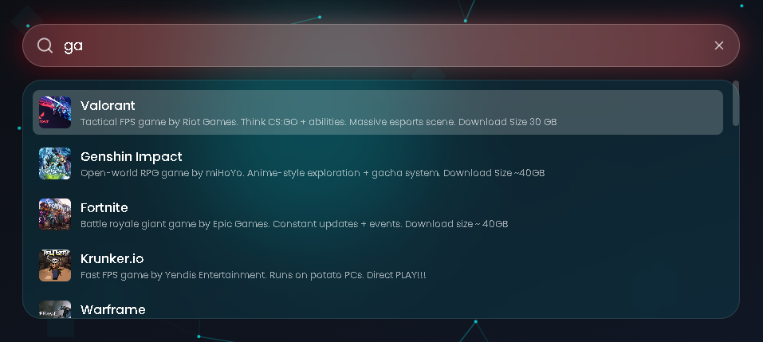
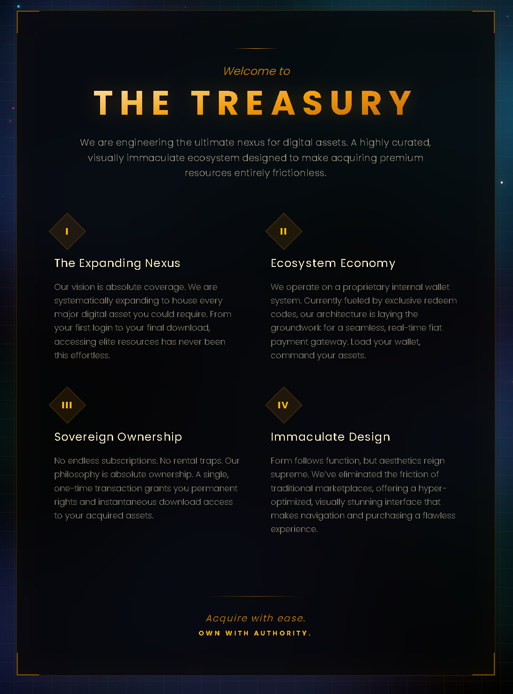

# 🏦 The Treasury

<p align="center">

A modern full-stack digital marketplace built using the **MERN Stack** that demonstrates authentication, digital product management, admin controls, coupon redemption, responsive UI design and production-style application architecture.

Built for learning, portfolio showcase and demonstrating real-world full-stack development skills.

</p>

---

<p align="center">

### 🌐 Live Demo

## https://thetreasury-orcin.vercel.app/

</p>

---

<p align="center">

## 🔑 Demo Credentials

### Administrator Account

| Username | Password |
|----------|----------|
| **Forge** | **1** |

Use the above credentials to explore the entire application, including all administrator-only features such as product management, coupon management and dashboard functionality.

</p>

---

# ⚠️ Important Notice

> ## This project is created **strictly for educational and portfolio purposes.**

- This project **does NOT support, encourage or promote piracy** in any form.
- We **do NOT own** any games, software, trademarks, logos or copyrighted material displayed throughout the application.
- All products, descriptions, screenshots and other content available on this website are **demo data** used only to demonstrate software engineering and full-stack development skills.
- This project is completely **non-commercial** and **does not generate any monetary gain**.
- The purpose of this project is to showcase frontend engineering, backend integration, authentication, REST API architecture and modern web application development.

---

# 📸 Application Preview

> The following screenshots are taken from the live application.

---

## 🏠 Landing Page

Modern responsive landing page introducing the platform.



---

## 🔐 Authentication

Secure login and registration system.



---

## 🛍 Marketplace

Browse digital products with searching, filtering and responsive layouts.


---

## 📄 Product Details

Detailed product page displaying screenshots, description and product information.



---

## 👤 User Dashboard

Users can manage owned products, account information and redeem coupons.



---

## ⚙️ Product Upload

Administrator interface for uploading and managing products.



---

## 🎟 Coupon Management

Administrator coupon management panel.



---

## 👾 Interactive 404 Page

Instead of displaying a traditional "404 Not Found" page, this project includes a fully interactive **space shooter mini-game** to improve user experience and make unexpected navigation more engaging.



---

## 📱 Responsive Design

Designed to work across desktop, tablet and mobile devices.



---

## 🔍 Smart Search

Quickly find products using the built-in search functionality, making it easy to discover games and digital content instantly.



---

## ℹ️ About Us

Learn more about the vision behind The Treasury, its purpose, and the technologies used to build the platform through a dedicated About page.



---

# ✨ Features

## 👤 User Features

- User Registration
- Secure Login
- Forgot Password
- Password Reset
- JWT Authentication
- Protected Routes
- Product Browsing
- Product Details
- Product Search
- Responsive Navigation
- Redeem Coupons
- Personal Dashboard
- Owned Product Library
- Modern Responsive UI

---

## 🛠 Administrator Features

- Administrator Dashboard
- Upload New Products
- Modify Existing Products
- Coupon Creation
- Coupon Management
- Product Management
- User Management
- Cloud Image Uploads

---

## 🎨 User Experience

- Responsive Design
- Modern Landing Page
- Animated Layouts
- Smooth Page Transitions
- Professional Background Effects
- Mouse Glow Effects
- Smooth Scrolling
- Interactive Components
- Custom Space Shooter 404 Page

---

# 🛠 Technology Stack

## Frontend

- React
- Vite
- JavaScript (ES6+)
- React Router
- Context API
- Axios
- CSS3

---

## Backend

- Node.js
- Express.js
- MongoDB
- Mongoose

---

## Authentication

- JWT
- bcryptjs

---

## Cloud Services

- Cloudinary

---

## Deployment

- Vercel
- Render
- MongoDB Atlas

---

# 🏗 Project Architecture

```text
                    React Frontend
                          │
                          │
                    Context API
                          │
                          │
                     Axios Client
                          │
                          │
                Express REST API
                          │
                          │
                     MongoDB Atlas
```

The frontend follows a modular, component-driven architecture where reusable UI components, centralized authentication state, API abstraction and page-based routing work together to create a scalable and maintainable application.

---

# 📂 Project Structure

```text
the-treasury-frontend

├── public/
│
├── src/
│   ├── api/
│   │   └── axios.js
│   │
│   ├── assets/
│   │
│   ├── components/
│   │   ├── common/
│   │   │   ├── Cyberpunk404.jsx
│   │   │   ├── Lenis.jsx
│   │   │   ├── MouseGlow.jsx
│   │   │   └── Stairs.jsx
│   │   │
│   │   ├── Dashboard/
│   │   │   ├── Coupons.jsx
│   │   │   ├── OwnedProduct.jsx
│   │   │   ├── RedeemCoupons.jsx
│   │   │   ├── UpdateProducts.jsx
│   │   │   └── UploadForm.jsx
│   │   │
│   │   ├── Home/
│   │   │   ├── About.jsx
│   │   │   ├── AllProducts.jsx
│   │   │   ├── Codex.jsx
│   │   │   ├── SearchBar.jsx
│   │   │   └── Swiper.jsx
│   │   │
│   │   ├── layout/
│   │   │   ├── AnimatedLayout.jsx
│   │   │   ├── ProfessionalBg.jsx
│   │   │   └── WelcomeBg.jsx
│   │   │
│   │   ├── Login&Register/
│   │   │   ├── LoginCard.jsx
│   │   │   ├── RegisterCard.jsx
│   │   │   ├── ForgotPassword.jsx
│   │   │   └── ResetPassword.jsx
│   │   │
│   │   ├── Navbar/
│   │   │
│   │   └── Product/
│   │       ├── ModifyProducts.jsx
│   │       └── UploadedProducts.jsx
│   │
│   ├── context/
│   │   └── AuthContext.jsx
│   │
│   ├── Pages/
│   │   ├── Home.jsx
│   │   ├── Dashboard.jsx
│   │   └── ProductDetailsPage.jsx
│   │
│   ├── App.jsx
│   ├── main.jsx
│   └── index.css
│
├── package.json
├── vite.config.js
├── vercel.json
└── README.md
```

---

# 🚀 Getting Started

Clone the repository.

```bash
git clone https://github.com/Tekade-Ji/the-treasury-frontend.git
```

Move into the project folder.

```bash
cd the-treasury-frontend
```

Install dependencies.

```bash
npm install
```

Run the development server.

```bash
npm run dev
```

Create a production build.

```bash
npm run build
```

Preview the production build.

```bash
npm run preview
```

---

# 🔑 Environment Variables

Create a `.env` file inside the project root.

```env
VITE_API_URL=
```

---

# 📦 Major Components

### 🏠 Home

- Landing Page
- Product Showcase
- Search Section
- Featured Products
- About Section
- Swiper Carousel

---

### 🔐 Authentication

- Login
- Registration
- Forgot Password
- Reset Password
- Protected Routes

---

### 👤 Dashboard

- Owned Products
- Coupon Redemption
- Product Upload
- Product Modification
- Coupon Management

---

### 📦 Product System

- Product Listing
- Product Details
- Product Actions
- Product Visualization

---

### 🎨 UI & Experience

- Animated Page Layouts
- Professional Background Effects
- Mouse Glow Animation
- Smooth Scrolling
- Responsive Navigation
- Interactive Components
- Gamified 404 Experience

---

# 🎯 Project Highlights

This project focuses on delivering a production-inspired user experience while maintaining a modular and scalable React architecture.

Some notable highlights include:

- Clean Component Architecture
- Context API for Authentication
- Axios API Abstraction Layer
- Protected Routes
- Responsive Design
- Modular Folder Organization
- Interactive UI Animations
- Administrator Dashboard
- Coupon Management System
- Product Upload Workflow
- REST API Integration
- Modern User Experience
- Custom Interactive 404 Mini Game

---

# 🧠 What I Learned

Developing this project significantly improved my understanding of:

- React Fundamentals
- Component Based Architecture
- Context API
- State Management
- React Router
- Axios Integration
- REST API Communication
- Authentication using JWT
- Protected Routes
- Responsive Web Design
- Production Project Structure
- Building Complete Full-Stack Applications
- Deploying React Applications

---

# 🔗 Related Repository

### Backend Repository

https://github.com/Tekade-Ji/the-treasury-backend

---

# 🌟 Acknowledgements

This project was built as part of my learning journey to gain hands-on experience in designing, developing and deploying modern full-stack web applications.

It combines frontend engineering, backend integration, authentication, responsive design and production-oriented architecture into a single portfolio project.

---

# 📄 License

This project was created for educational and portfolio purposes.

---

# 👨‍💻 Author

## Yash Tekade

GitHub

https://github.com/Tekade-Ji

---

<p align="center">

⭐ If you found this project interesting, consider giving it a star.

Thank you for visiting!

</p>
